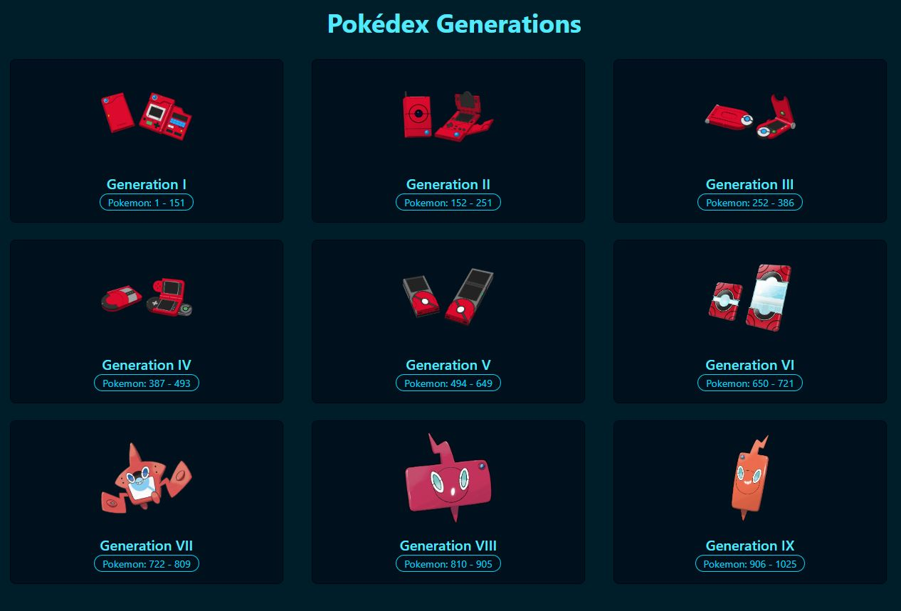
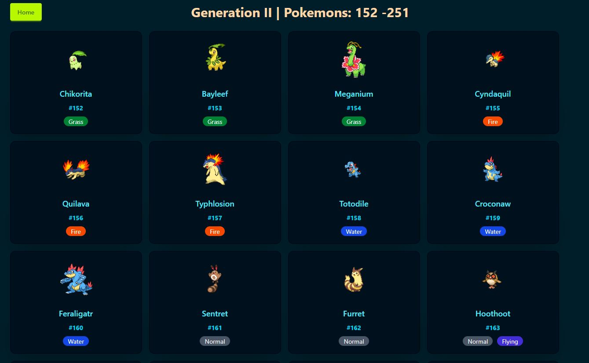
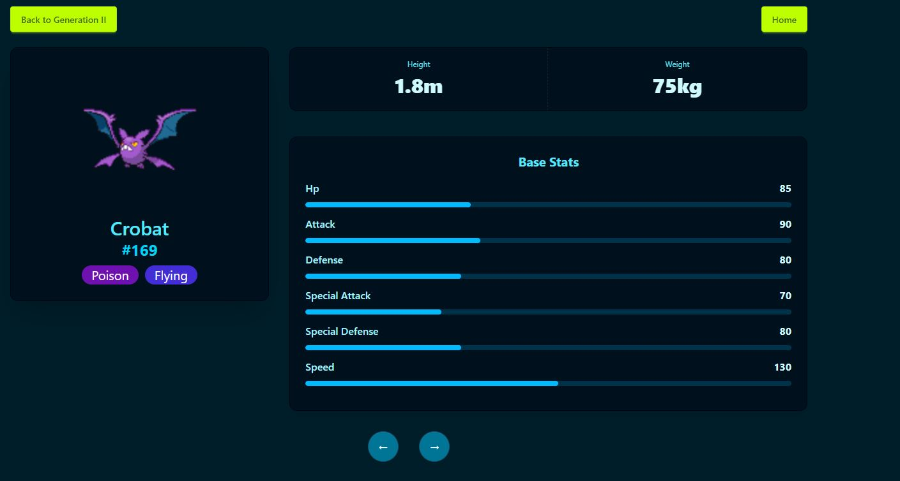

# Pokedex Generations

## Live Deployment

[View the deployed app on Netlify](https://pokedexgenerationz.netlify.app/)

### Home Page

### Pokedex Page

### Pokémon Detail Page

## Usage
Browse the Pokédex by selecting a generation from Generation I to Generation IX. View all Pokémon belonging to the selected generation. Click on an individual Pokémon to see its detailed Pokédex entry. Use the arrow buttons below the entry to navigate to the previous or next Pokémon.

## App Flowchart
1) Home Page
- Displays all Pokemon generations using const generations from pokemonData.js
- Clicking on a pokedex, respective to their generation, will "Navigate" us to the Pokedex Page (/pokedex/:genID ).

2) Pokedex Page (/pokedex/:genID )
- We will use genID from the URL params (useParams) to fetch Pokemon from a specific generation.
- Fetches summary data, then details the Pokemon data. ex: types, images, and etc
- Displays them using the component PokmeonGrid, which maps each Pokemon to the PokemonCard oomponent.

3) PokemonCard Component
- Wrapped in a < Link > to /pokemon/:id, making each Pokemon card clickable!

4) Pokemon Detail Page (/pokmeon/:id)
- uses id from URL params to fetch full Pokemon details.
- Dynamically determines the generation using .find on generations.
- Displays info via the following components:
    * PokemonDetailImage, PokemonDetailHeader, PokemonDetailMeta, PokemonDetailStats
- We will implement navigation through the component PokemonDetailNav for moving between previous and next Pokemon. Button!

## Navigation
- Home -> Pokedex: via useNavigate() and (/pokedex/:genId) as dynamic route.
- Pokedex -> Details: via < Link to={/pokemon/${pokemon.id}} >
- Detail -> Prev/Next: via button logic in PokeonDetailNav
- Detail -> Back to Generations: via link to /pokedex/${generation.id}

## State Management
- Each page handles its own loading and data states using useState and useEffect.

## Reusability
- Our components are cleanly split by concern: Card, Grid, Detail, Nav, Stats, and etc.
- Types, stats, and images are reusable visual elements.

## Technologies:

### Frontend

### API Integration

### Deployment

## Possible Improvements:
- Adding a search bar within the Pokedex.

- Adding a load more button or pagination.